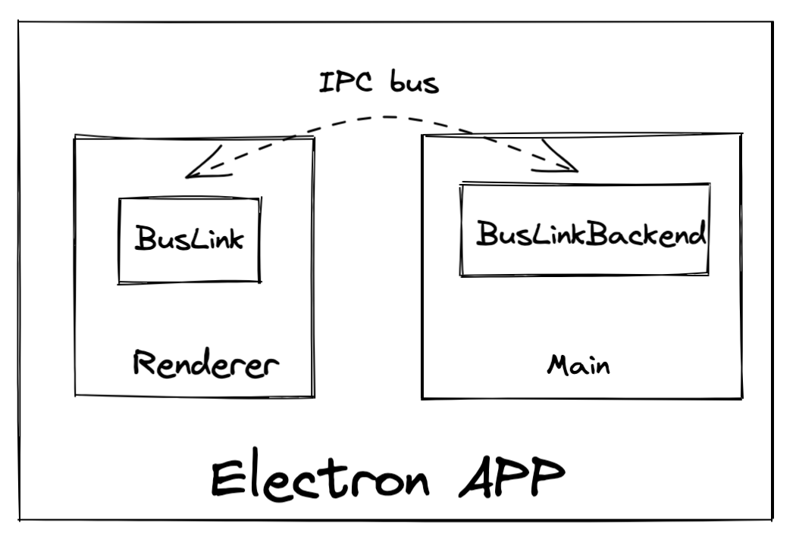
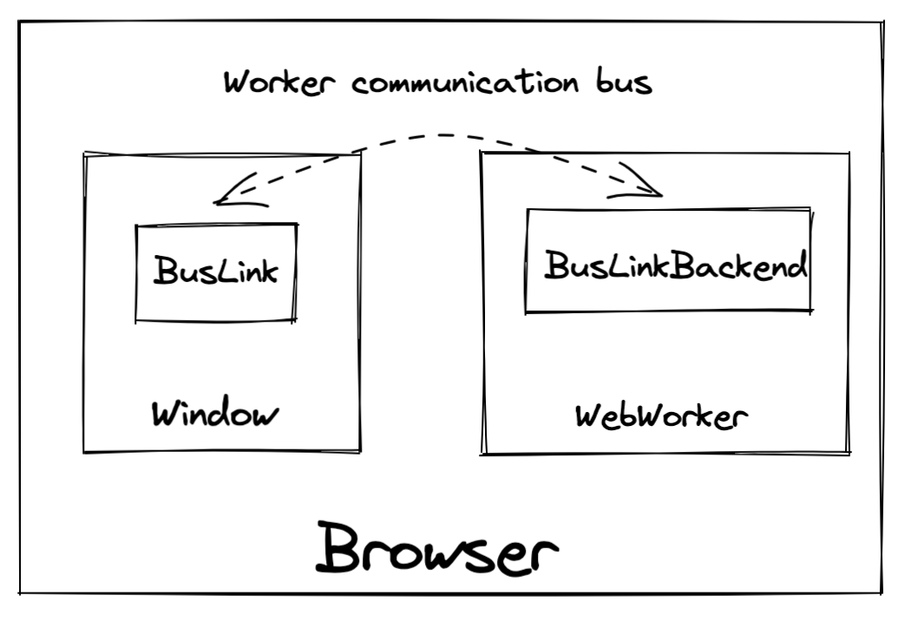

<h1 align="center">
:trolleybus::busstop: apollo-bus-link :busstop::bus:
  <p align="left">
    
  </p>
</h1>

[](https://github.com/freshollie/apollo-bus-link/actions)
[](https://codecov.io/gh/freshollie/apollo-bus-link)
[](https://github.com/prettier/prettier)

> Your one stop for message bus apollo links

## What is this?

Complex GraphQL based applications may use a separate process to run
schema execuation.

This library provides a set of tools which can used to create an ApolloLink
and a Schema Executor which can communicate across any JS based message bus.

This library provides pre-written receipes for `electron` and `webworker`'s

<p align="center">
  
  
</p>

## Features

- API to integrate with any Bus
- Subscriptions, Queries, and Mutations
- Built in support for Electron and WebWorker buses

## Usage

<details>
  <summary>Electron :electron:</summary>

Main

```typescript
import {
  createBusLinkBackend,
  createSchemaExecutor,
} from "apollo-bus-link/core";
import { electronBus } from "apollo-bus-link/electron";
import { ipcMain } from "electron";

// Args come from the link through `.initialiseBackend`
// You can pass whatever object you want
export type Args = {
  mockedMode: boolean;
};

const backend = createBusLinkBackend<Args>({
  registerBus: electronBus(mockIpc.ipcMain),
  createExecutor: (args) =>
    createSchemaExecutor({
      // Same API as apollo-server etc
      schema,
      context,
    }),
});
// If you want to preiniitalise the backend, this can be done
// by calling initialise
// backend.initialise(...)
backend.listen();
```

Renderer

```typescript
import { createElectronBusLink, electronBus } from "apollo-bus-link/electron";
import { ipcRenderer } from "electron";
import { ApolloClient } from "@apollo/client/core";

const link = createElectronBusLink<Args>(ipcRenderer);
await link.initialiseBackend({ mockedMode: false });

const client = new ApolloClient({
  link,
  ...
});
```

</details>

<details>
  <summary>WebWorker :factory_worker:</summary>

Worker

```typescript
import {
  createBusLinkBackend,
  createSchemaExecutor,
} from "apollo-bus-link/core";
import { webWorkerBus } from "apollo-bus-link/electron";

// Args come from the link through `.initialiseBackend`
// You can pass whatever object you want
export type Args = {
  mockedMode: boolean;
};

const backend = createBusLinkBackend<Args>({
  registerBus: webWorkerBus(self),
  createExecutor: (args) =>
    createSchemaExecutor({
      schema,
      context,
    }),
});

// If you want to preiniitalise the backend, this can be done
// by calling initialise
// backend.initialise(...)
backend.listen();
```

Window

```typescript
import { createWebWorkerBusLink } from "apollo-bus-link/webworker";
import { ApolloClient } from "@apollo/client/core";

const worker = new Worker(
  new URL("./Worker.ts", import.meta.url)
);

const link = createWebWorkerBusLink<Args>(worker);
await link.initialiseBackend({ mockedMode: false });

const client = new ApolloClient({
  link,
  ...
});
```

</details>

<details>
  <summary>Custom</summary>

Backend

```typescript
import {
  createBusLinkBackend,
  createSchemaExecutor,
} from "apollo-bus-link/core";

const backend = createBusLinkBackend<Args>({
  registerBus: (request) => {
    myMessageBus.onMessage((message) =>
      // It may be that you need the context of the initial message
      // to be able to response, hence this being callback hell
      request(message, (response) => {
        myMessageBus.send(response);
      })
    );
  },
  createExecutor: (args) =>
    createSchemaExecutor({
      // Same API as apollo-server etc
      schema,
      context,
    }),
});
```

Link

```typescript
import { BusLink } from "apollo-bus-link/core";
import { ApolloClient } from "@apollo/client/core";

const link = new BusLink({
  requestHandler: (request) => {
    myMessageBus.send(request);
  },
  registerResponseHandler: (handler) => {
    myMessageBus.onMessage((response) => handler(response));
  },
});
await link.initialiseBackend({ mockedMode: false });

const client = new ApolloClient({
  link,
  ...
});
```

</details>

## In the wild

- [fresh-configurator](https://github.com/freshollie/fresh-configurator) - Used as both in webworker and electron formats depending on where the app is loaded

## Licence

`MIT`
